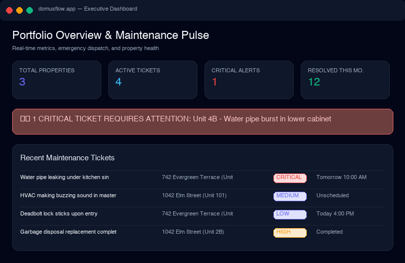
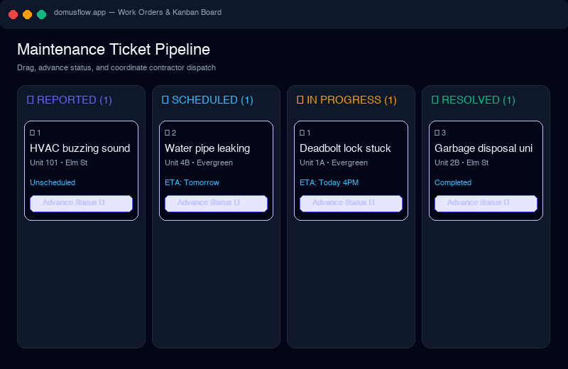
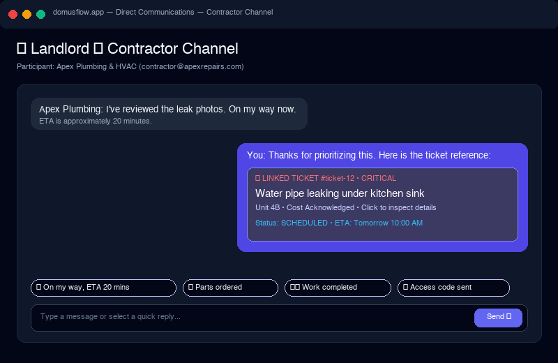
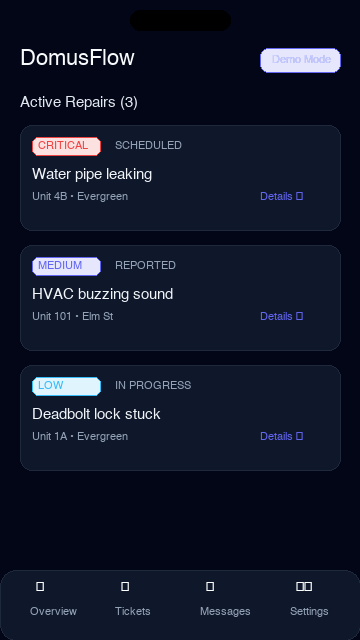

# DomusFlow Interface Showcase

Visual previews and screenshot gallery for the DomusFlow maintenance platform.

---

### Landlord Executive Dashboard

 _Real-time pulse overview, property portfolio KPIs,
active maintenance tickets, and critical emergency banner._

---

### Work Orders & Kanban Board

 _4-column maintenance pipeline (Reported, Scheduled, In
Progress, Resolved) with 1-click status transitions and photo evidence counts._

---

### Direct Communications (Contractor Channel)

 _Isolated Landlord ↔ Contractor chat featuring interactive
linked ticket references and one-tap canned status replies._

---

### Mobile PWA & Capacitor View

 _Responsive mobile layout with touch-friendly navigation, quick
status updates, and camera photo capture._
